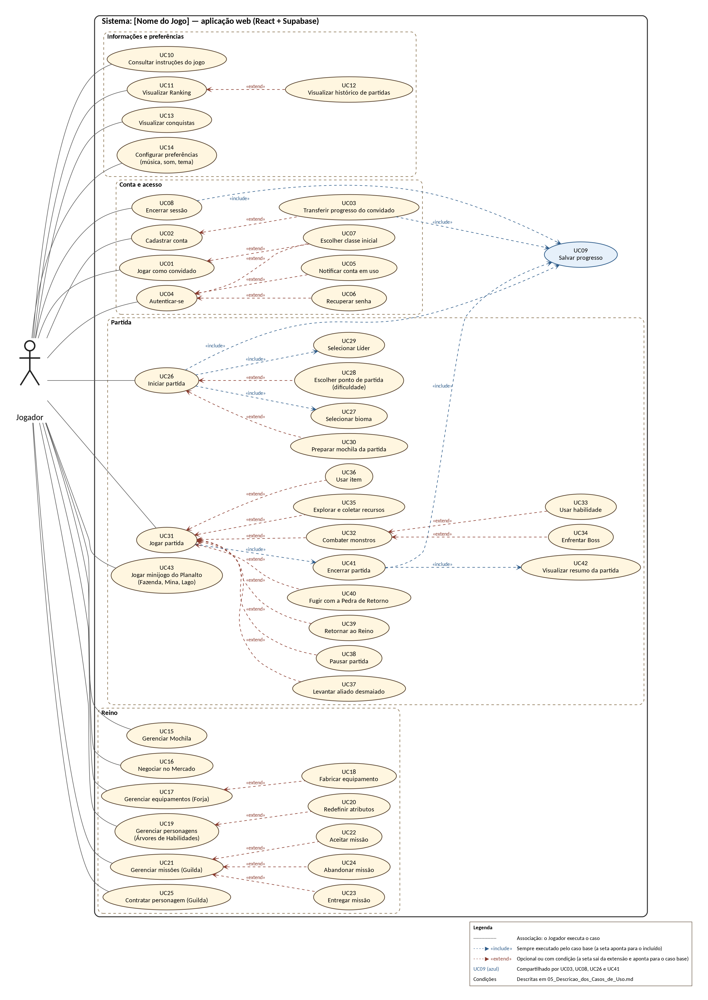

# RPG

**Tema:** RPG

**Alunos:** Pablo Detoni, Lucas Garcia e Uener Peres

Esta pasta reúne a documentação conceitual do projeto para Análise e Projeto de Sistemas (TI23L) e Desenvolvimento Web 2. Em caso de divergência, vale o conteúdo desta documentação.

## Diagrama de Casos de Uso

## Arquivos

| Arquivo | Conteúdo |
|---|---|
| [Conceito do jogo (PDF)](ideias/01_Conceito_do_Jogo.pdf) ([Word](ideias/01_Conceito_do_Jogo.docx)) | Conceito completo do jogo e conceito do beta (dezembro de 2026) |
| [Diagrama de Casos de Uso (PNG)](diagramas/02_Diagrama_Casos_de_Uso.png) ([PlantUML](diagramas/02_Diagrama_Casos_de_Uso.puml)) | Diagrama de Casos de Uso, com «include» e «extend» |
| [Diagrama de Atividades: Acesso (PNG)](diagramas/03_Diagrama_Atividades_Acesso.png) ([PlantUML](diagramas/03_Diagrama_Atividades_Acesso.puml)) | Acesso ao jogo (convidado, cadastro, login, sessão única) |
| [Diagrama de Atividades: Partida (PNG)](diagramas/04_Diagrama_Atividades_Partida.png) ([PlantUML](diagramas/04_Diagrama_Atividades_Partida.puml)) | Partida, do mapa ao resumo |
| [Diagrama de Atividades: Guilda (PNG)](diagramas/05_Diagrama_Atividades_Guilda.png) ([PlantUML](diagramas/05_Diagrama_Atividades_Guilda.puml)) | Missões e contratos na Guilda |
| [Descrição dos Casos de Uso](docAdicional/06_Descricao_dos_Casos_de_Uso.md) | Descrição de cada caso de uso, com relacionamentos e condições |
| [Histórias de Usuário](docAdicional/07_Historias_de_Usuario.md) | Uma história de usuário para cada caso de uso, com critérios de aceite |
| [Requisitos](docAdicional/08_Requisitos.md) | Requisitos funcionais e não funcionais |
| [Matriz de Rastreabilidade](docAdicional/09_Matriz_de_Rastreabilidade.md) | Ligação entre casos de uso, requisitos, histórias e diagramas de atividades |
| [Balanceamento](Balanceamento.md) | Todos os números do jogo (XP, atributos, taxas, ouro, peso, contratos) e seus limites. Gerado pelo código: não edite à mão |

## Alterações do projeto

Durante a programação, algumas decisões mudaram ou completaram esta documentação. Os textos já estão atualizados, e cada documento termina com uma seção **Alterações do projeto** que lista o que mudou e por quê (a lista completa, com os motivos, está nos [Requisitos](docAdicional/08_Requisitos.md#alterações-do-projeto)). O Conceito do jogo tem a mesma seção no fim. O Diagrama de Atividades da Partida foi atualizado: o minijogo e a Preparação voltam ao Mapa.

## Números

43 casos de uso · 55 requisitos funcionais · 14 requisitos não funcionais · 43 histórias de usuário · 3 diagramas de atividades.

Os arquivos .puml podem ser abertos em qualquer editor de PlantUML (por exemplo, planttext.com) para editar os diagramas.
